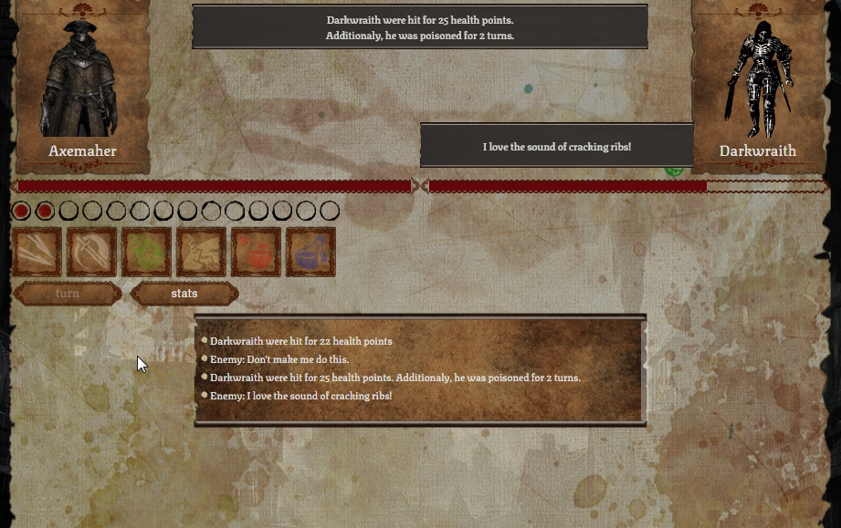

# simplified turn-based battle game called Covid Slayer.
Duel simulation based on thoughtful management of action points.
The project is constantly being developed

## Screenshot

## Technologies
* HTML
* CSS
* JS
* React

## Features
* Game depends on action points.
* The log informs us about the current course of the fight.
* We have several types of skills to use, e.g. attack, power attack or Heal.

## Built with
* React
* redux
* game-icons.net

## Setup
After you clone this repo to your desktop, go to its root directory and run npm install to install its dependencies.

Once the dependencies are installed, you can run npm start to start the application. You will then be able to access it at localhost:3000

